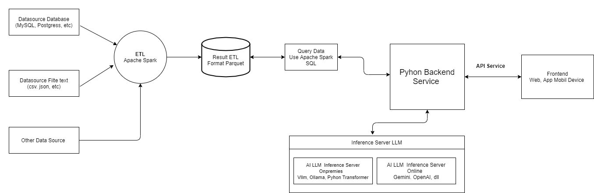
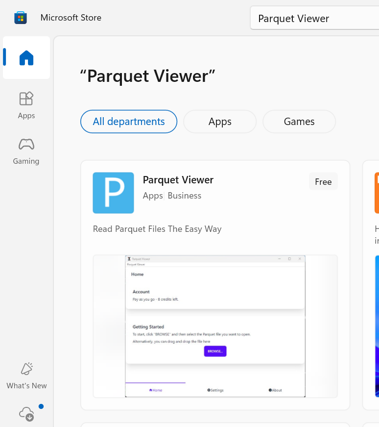
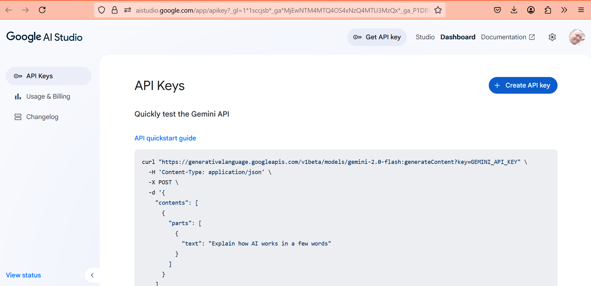
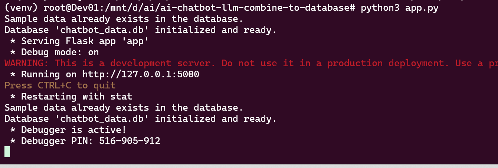

# Revolutionizing RAG Leveraging Apache Spark Big Data for Intelligent AI Chatbots

Revolutionizing RAG (Retrieval Augmentation Generation) Leveraging Apache Spark Big Data for Intelligent AI Chatbots

Have you ever been frustrated with your AI chatbot giving incoherent or ‘hallucinatory’ answers? In the era of big data, accuracy is everything. We’ve discovered how Retrieval-Augmented Generation (RAG) powered by the power of Apache Spark Big Data can dramatically change the game, making your chatbot not only intelligent, but also highly reliable.

Here’s the Architecture




# Table of Contents Creat ETL Big Data Apache Spark

1.  [Concept of ETL with Apache Spark](http://github.com/dendie-sanjaya/apache-spark-etl#konsep-etl-dengan-apache-spark)
      * [Data Sources](http://github.com/dendie-sanjaya/apache-spark-etl#data-sources)
      * [Apache Spark Data Source Flexibility](http://github.com/dendie-sanjaya/apache-spark-etl#apache-spark-data-source-flexibility)
      * [Apache Spark ETL Output Destinations](http://github.com/dendie-sanjaya/apache-spark-etl#apache-spark-etl-output-destinations)
2.  [Environment Setup](http://github.com/dendie-sanjaya/apache-spark-etl#environment-setup)
      * [1. Python Installation](http://github.com/dendie-sanjaya/apache-spark-etl#1-python-installation)
      * [2. JRE (Java Runtime Environment) Installation](http://github.com/dendie-sanjaya/apache-spark-etl#2-jre-java-runtime-environment-installation)
      * [3. PySpark Installation](http://github.com/dendie-sanjaya/apache-spark-etl#3-pyspark-installation)
3.  [Project Structure](http://github.com/dendie-sanjaya/apache-spark-etl#project-structure)
4.  [ETL Process Steps](http://github.com/dendie-sanjaya/apache-spark-etl#etl-process-steps)
      * [1. Creating Sample Data (`setup_db.py`)](http://github.com/dendie-sanjaya/apache-spark-etl#1-creating-sample-data-setup_db.py)
      * [2. Core ETL Process (`etl_process.py`)](http://github.com/dendie-sanjaya/apache-spark-etl#2-core-etl-process-etl_process.py)
          * [Download SQLite JDBC Driver](http://github.com/dendie-sanjaya/apache-spark-etl#download-sqlite-jdbc-driver)
          * [ETL Program Code](http://github.com/dendie-sanjaya/apache-spark-etl#etl-program-code)
          * [ETL Process Output](http://github.com/dendie-sanjaya/apache-spark-etl#etl-process-output)
5.  [Verifying ETL Results](http://github.com/dendie-sanjaya/apache-spark-etl#verifying-etl-results)
      * [1. Viewing Parquet Data with GUI](http://github.com/dendie-sanjaya/apache-spark-etl#1-viewing-parquet-data-with-gui)
      * [2. Querying ETL Results Using Apache Spark SQL](http://github.com/dendie-sanjaya/apache-spark-etl#2-querying-etl-results-using-apache-spark-sql)


## Apache Spark  

Apache Spark is a highly popular and powerful open-source distributed data processing framework designed to handle various big data workloads, including **ETL (Extract, Transform, Load)**. In this guide, we'll explore how to perform ETL using **Python** through the **PySpark** library.


### Concept of ETL with Apache Spark

In this example, we'll create an ETL program to retrieve log activity data. The final output data from this process will be stored in **Parquet format**, an extremely efficient columnar data format within the Apache Spark ecosystem.


#### Data Sources

This process will combine data from two different sources:

1.  **Relational Database (SQLite):** Contains device data.
2.  **CSV File:** Contains device log activity.

Apache Spark will **join** these two data sources using the common key column **`device_id`**.

#### Apache Spark Data Source Flexibility

Apache Spark is highly flexible and can read data from various sources, including:

  * **Files:** Parquet, ORC, CSV, JSON, Avro, Text.
  * **Relational Databases:** MySQL, PostgreSQL, Oracle, SQL Server (via JDBC/ODBC).
  * **Distributed Storage:** HDFS, Amazon S3, Azure Blob Storage, Google Cloud Storage.
  * **NoSQL Databases:** Cassandra, HBase, MongoDB.
  * **Streaming Data:** Kafka, Amazon Kinesis, Azure Event Hubs.
  * **Data Lake Table Formats:** Delta Lake, Apache Hudi, Apache Iceberg.

#### Apache Spark ETL Output Destinations

The output of the Apache Spark ETL process can also be saved to various destinations, including:

  * **Files:** Parquet, ORC, CSV, JSON, Avro, Text.
  * **Relational Databases:** MySQL, PostgreSQL, Oracle, SQL Server (via JDBC/ODBC).
  * **Distributed Storage:** HDFS, Amazon S3, Azure Blob Storage, Google Cloud Storage.
  * **NoSQL Databases:** Cassandra, HBase, MongoDB, Elasticsearch.
  * **Streaming Data:** Kafka, Amazon Kinesis, Azure Event Hubs.
  * **Data Lake Table Formats:** Delta Lake, Apache Hudi, Apache Iceberg.


### Environment Setup

Before running the ETL program, ensure you have several prerequisites installed on your computer.

#### 1\. Python Installation

Make sure you have **Python version 3.7** or higher installed on your computer.

#### 2\. JRE (Java Runtime Environment) Installation

To run Apache Spark, at least **JRE version 17** must be installed on your computer. You can install it using the following command on Debian/Ubuntu-based systems:

```bash
sudo apt install openjdk-17-jdk
```


#### 3\. PySpark Installation

Install the PySpark library using `pip`:

```bash
pip install pyspark
```


When you run the `pip install pyspark` command, pip not only installs the Python bindings for Spark but also downloads and includes the complete Apache Spark binaries (JAR files, scripts, etc.) required for Spark to run, even in local mode.

-----

### Project Structure

Here's the directory and file structure for our project:


### ETL Process Steps

#### 1\. Creating Sample Data (`setup_db.py`)

The `setup_db.py` file contains Python code to populate sample data into an SQLite database. This will serve as one of our data sources.


#### 2\. Core ETL Process (`etl_process.py`)

The  file is the core of our ETL program. Before running it, make sure you download the necessary SQLite JDBC driver for Apache Spark to read data from the SQLite database.

##### Download SQLite JDBC Driver

Visit the Maven Central repository to download the latest version of the SQLite JDBC driver. Search for `https://mvnrepository.com/artifact/org.xerial/sqlite-jdbc` (e.g., `sqlite-jdbc-3.49.1.0.jar`). Once downloaded, place this `.jar` file in a location accessible by Spark (e.g., in your project directory or on Spark's classpath).

##### ETL Program Code

The  file contains the Python code to perform the ETL process in Apache Spark, as described in the concepts above.


##### ETL Process Output

After the ETL process is complete, the results will be saved in **Parquet file format**, optimized for Apache Spark.


### Verifying ETL Results

#### 1\. Viewing Parquet Data with GUI


Data stored in Parquet format can be easily opened and viewed using a GUI like **Parquet Viewer**.




#### 2\. Querying ETL Results Using Apache Spark SQL

You can also query the ETL results directly using **Apache Spark SQL** to verify them. 

 
 


By following these steps, you can successfully perform an ETL process using Apache Spark and Python, processing data from various sources and saving it in an efficient format for further analysis.


# Table of Contents Chabot AI LLM 

  * [1. Create Gemini API Key]
  * [2. Python & Dependencies Installation]
  * [3. Creating the Chatbot Backend Program]
  * [4. Creating the Chatbot Frontend Program]


# AI LLM 

Machine Learning (ML) is a branch of artificial intelligence (AI) that studies patterns and makes predictions based on data.

LLM, or Large Language Model, is a type of ML model trained using a massive amount of text to understand and generate natural language.

The code example presented here demonstrates a combination of AI LLM and a Apache Spark Big Data  to answer user questions by integrating with internal data.

For instance, to inquire about the online status of a device, the data flow will involve querying an internal data i apache spark to retrieve the device's status.


The example below utilizes the Gemini LLM API.


Video Demo  1 -> 


## 1\. Create Gemini API Key

The first step is to create an API Key on aistudio.google.com to access the Gemini AI LLM using its API.



## 2\. Python & Dependencies Installation

To set up the Python environment and install the necessary libraries, follow these steps:

```bash
apt install python3.10-venv
python3 -m venv venv
source venv/bin/activate
pip install Flask Flask-Cors google-generativeai python-dotenv
```

## 3\. Creating the Chatbot Backend Program

Below is the Python script for the backend, which processes user queries by integrating the Gemini LLM API and a local Database.


**How to Run:**

```bash
python3 app.py
```




## 4\. Creating the Chatbot Frontend Program

Below is the script for the web-based frontend program that processes questions and displays AI-generated answers. This frontend can be run on a web server like Apache or Nginx, or simply by opening the HTML file directly in your browser while the backend is running.


## Contact

If you have questions, you can contact this email
Email: dendie.sanjaya@gmail.com